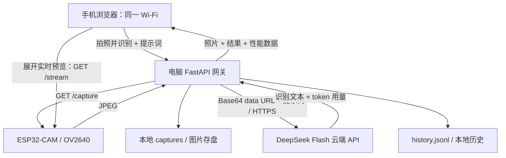

# ESP32-CAM Vision Web

一个运行在电脑上的局域网视觉网关：手机打开网页，触发 ESP32-CAM 拍照，并查看 DeepSeek Flash 的云端识别结果。

**当前版本：v0.2.0。** 本版加入已在 AI Thinker ESP32-CAM 上烧录的 WiFiManager 固件和移动端控制台细节调整；版本变更见 [CHANGELOG.md](CHANGELOG.md)。

**ESP32 不运行模型，电脑是网关。** 这不是板上 AI 推理，也不是手机摄像头应用。拍到的是 ESP32-CAM 镜头前的场景。



## 前置条件

- AI Thinker ESP32-CAM（OV2640），已烧录本仓库的 WiFiManager 固件，或仍使用 Espressif 官方 CameraWebServer。
- 电脑能打开相机首页，相机 `/capture` 能返回 JPEG；ESP32 使用支持的 2.4 GHz Wi-Fi。
- 手机、电脑和相机位于可互访的局域网。手机不必使用同一频段，但路由器不能启用客户端隔离。
- Python 3.10+；电脑可连接互联网；有效且有余额的 DeepSeek API Key。
- 当前接口按 DeepSeek `deepseek-flash` 图片输入协议实现。账号可用性、模型能力和费用由服务提供商决定。

## 可选：烧录带配网功能的相机固件

本仓库提供 [`firmware/ESP32CAM_WiFiManager/ESP32CAM_WiFiManager.ino`](firmware/ESP32CAM_WiFiManager/ESP32CAM_WiFiManager.ino)。已能稳定运行官方 CameraWebServer 的设备可以继续使用原固件。新固件保留 `/capture`，并增加 `/status`、可折叠的实时预览所需 `/stream`；电脑后端无需改动。

1. 在 Arduino IDE 安装 **tzapu 的 WiFiManager 2.x**（本次烧录使用 2.0.17），选择 **AI Thinker ESP32-CAM** 板型和对应串口。本次使用的 ESP32 Arduino core 为 3.3.12。
2. 打开仓库中的 `.ino`。如底座需要手动进入下载模式，按住 **IO0**，短按并松开 **RST**，再松开 IO0；点击 Upload。烧录完成后，只短按 RST 正常启动。串口监视器设为 115200。
3. 首次启动或旧 Wi-Fi 不可达时，相机尝试连接约 15 秒后开启无密码热点 **AI-Vision-Setup**。连接该热点，访问 `http://192.168.4.1`，选择 **2.4 GHz、个人密码制** Wi-Fi 并保存。配网页面等待约 10 分钟；超时后设备重启重试。串口监视器会打印连接后的新 IP。
4. 将新 IP 写入本机 `config.json` 的 `camera_url`，例如 `http://<相机IP>`。手机、电脑和相机需要能互相访问；使用手机热点时，让电脑和相机连接该热点。相机 IP 变化后更新本机配置。

相机提供 `GET /capture`（JPEG）、`GET /status`（JSON）和 `GET /stream`。`/stream` 会重定向至相机的 **81 端口**，视频流独立于 80 端口的拍照服务。校园网等需要账号登录或 WPA2-Enterprise 的网络不适用于这套密码式配网流程。

**切换 Wi-Fi：**关闭或离开上一次连接的网络，短按 RST；连接失败后重新进入 AI-Vision-Setup 配网。运行时**不要长按 IO0 清除配置**：ESP32-CAM 的 IO0 同时是摄像头时钟引脚，本版没有实现 IO0 长按重置。IO0 仅在需要进入下载模式烧录时使用。

## 安装

```sh
git clone https://github.com/Jethro5977/esp32-cam-vision-web.git
cd esp32-cam-vision-web
python3 --version
python3 -m venv .venv
source .venv/bin/activate
pip install -r requirements.txt
```

macOS 系统的 `python3` 可能过旧；若已安装 Python 3.11，可用 `python3.11 -m venv .venv`。Windows 使用 `py -3 -m venv .venv`，PowerShell 激活命令为 `.venv\Scripts\Activate.ps1`。

## 第一次配置

1. 复制 `config.example.json` 为 `config.json`。
2. 将 `camera_url` 的空字符串改成实际相机首页地址，格式为 `http://<相机IP>`；不要包含 `/capture`。配置文件中的占位符必须换成真实值。
3. 在项目目录运行：

```sh
python setup_key.py
```

终端出现隐藏输入提示后粘贴 API Key 并回车。密钥不显示，也不要发到聊天或提交到 GitHub。脚本将 `.secrets/` 权限设为 700，密钥文件权限设为 600（POSIX 系统；Windows 使用其自身 ACL 权限）。

配置优先级：

- 相机：环境变量 `CAMERA_URL` → 根目录 `config.json` 的 `camera_url`。
- 密钥：环境变量 `DEEPSEEK_API_KEY` → `.secrets/deepseek_api_key`。

可通过自己的进程环境注入配置；不要把真实密钥写入脚本或 README。相机配置每次请求读取，无需修改源码。配置错误会显示中文提示。

## 启动与手机使用

```sh
source .venv/bin/activate
python app.py
```

默认监听 `0.0.0.0:8000`。自定义端口可以使用：

```sh
python -m uvicorn app:app --host 0.0.0.0 --port 8000 --workers 1
```

必须使用一个 worker；当前文件写入与相机并发锁在单个进程内生效。

查电脑局域网 IP：

- macOS：系统设置 → Wi-Fi → 当前网络“详细信息” → TCP/IP → IP 地址。终端可先运行 `networksetup -listallhardwareports` 查 Wi-Fi 接口名，再运行 `ipconfig getifaddr <接口名>`。
- Windows：运行 `ipconfig`，查看当前无线网卡的 IPv4 地址。
- Linux：运行 `ip -4 addr`，查看连接 Wi-Fi 的网卡地址。

手机浏览器打开 **`http://<电脑局域网IP>:8000`**，不是相机 IP，也不是 `0.0.0.0`。电脑防火墙如询问，请允许可信局域网访问。

1. 查看顶部相机是否在线，并确认已配置 API Key。
2. 将 ESP32-CAM 对准目标，选择预设或输入提示词。
3. 点击“拍照并识别”，等待结果；可点照片放大。
4. 展开历史查看最近 20 条；刷新页面会从电脑 JSONL 恢复。
5. 访问 `/api/stats` 获取全部历史的实测统计。

识别时电脑必须保持运行且联网。相机通常无需一直插电脑，稳定供电并接入同一局域网即可。网页不是持续视频分析；每次点击只发送一张照片。页面上的“查看实时画面”会让手机浏览器直接连接相机 `/stream`；收起时断开视频流。预览要求手机也能访问相机地址和 81 端口；拍照识别则由电脑访问相机。

## 局域网访问与隐私

`0.0.0.0` 会让局域网内所有能连接电脑的设备访问服务。本项目无登录验证：访问者可以发起有费用的识别、查看照片和历史。仅用于可信局域网的本地开发，不要通过端口转发、隧道或云服务器暴露到公网。

照片、提示词将发送至 DeepSeek；密钥只在电脑后端使用。代码不记录上游错误原文，不将密钥返回前端。图片和历史默认保留在电脑，无自动删除策略。停止服务后可自行删除 `captures/`、`history.jsonl` 清空数据。

`.gitignore` 排除了密钥、相机本机配置、照片、JSONL、虚拟环境和缓存。若密钥曾泄露，应在提供商后台撤销并重新生成。

## 接口

| 路径 | 说明 |
| --- | --- |
| `GET /` | 移动端页面 |
| `GET /api/health` | 服务状态、相机地址、在线状态、密钥是否配置；相机探测总时限 3 秒，不触发拍照 |
| `POST /api/analyze` | JSON 请求体 `{"prompt":"描述这张图"}`；拍照总时限 15 秒，API 总时限 60 秒 |
| `GET /api/history?limit=20` | 最近记录，新到旧；limit 为 1–20 |
| `GET /captures/<filename>` | 本地 JPEG 图片 |
| `GET /api/stats` | 历史性能统计 JSON |

识别响应和每条 JSONL 记录字段一致：`created_at`（UTC ISO 时间）、`status`、`image_url`、`text`、`timings`、`image_bytes`、`base64_length`、`usage`；失败时另有 `error`。未完成阶段的数据为 `null`。输入校验失败、并发拒绝不算识别尝试；已接受的请求成功/失败均写入历史。磁盘无法写入时明确报错，不能保证历史持久化。

图片命名为 `capture-YYYYMMDD-HHMMSS.jpg`（电脑本地时间）。同秒冲突等待下一秒，避免覆盖。JPEG 校验检查 FFD8 头和 FFD9 尾，不等同于完整解码校验。

## 性能数据口径

- `capture_ms`：获取图片并校验的耗时。
- `api_ms`：DeepSeek 网络请求及响应解析耗时。
- `total_ms`：从后端接受处理开始，到结果生成，含配置、拍照、图片存盘、编码和 API；不含 JSONL 最后追加、返回手机网络和浏览器渲染。
- `base64_length`：Base64 本体字符数，不含 `data:image/jpeg;base64,` 前缀。
- 网页 KB 按 1024 字节换算。
- `sample_count` 只统计成功记录；另有 `attempt_count` 和 `failure_count`。
- 各段统计提供 `mean`、`median`、`p95`；P95 使用最近秩法 `ceil(0.95 × N)`。
- `average_usage` 只统计上游实际提供的 token 数，同时返回每项的 `usage_sample_count`；缺失数据不作为零。
- 无样本时统计值为 `null`，不预填性能成绩。统计覆盖全部本地历史，网页仅显示最近 20 条。
- 损坏的 JSONL 行会跳过，`invalid_lines` 和网页警告会明确显示。

## 改版前的本机实测基线（2026-09-29）

15 次识别成功，失败 0 次。平均总耗时 **2,491 ms**，P95 **4,646 ms**，平均图片大小 **5.87 KB**，平均总用量 **478.9 tokens**（输入 233.9、输出 244.9）。测试经过电脑端接口和网页识别流程；iPhone Safari 尚未单独验证。

这组数据来自 **v0.2.0 WiFiManager 固件及本次界面调整之前** 的单台设备、单个局域网和小样本现场测量，不代表新固件或其他网络、相机、账户的性能。P95 使用最近秩法。数据快照：[汇总图片](benchmarks/2026-09-29-api-stats.png) · [原始统计 JSON](benchmarks/2026-09-29-api-stats.json)。只发布聚合数据，不发布相机照片、逐条历史、提示词或密钥。

## 常见问题

| 现象 | 处理 |
| --- | --- |
| 手机打不开电脑网页 | 检查电脑服务、IP、端口、防火墙、访客 Wi-Fi 和 AP 隔离 |
| 相机离线或超时 | 检查供电、相机 IP 是否变化，电脑直接访问相机首页 |
| JPEG 无效 | 检查 `/capture` 是否为官方取图端点，是否返回错误页或传输中断 |
| API Key 未配置 | 运行 `python setup_key.py`，确认在当前项目保存 |
| 401 密钥无效 | 更新或重新生成密钥；环境变量会覆盖文件 |
| 402 余额不足 | 检查 DeepSeek 账户余额 |
| 429 限流 | 等待后再试，减少请求频率 |
| 5xx / API 超时 | 稍后重试；超时前上游可能已处理并计费 |
| 有设备正在识别（409） | 等待当前识别完成；避免并发争用相机 |
| 照片保存了但识别失败 | 历史会保存失败原因和已有照片，后续阶段字段为 null |
| 识别文字不准确 | 改善光线、拍摄距离和提示词；模型输出不是事实保证 |
| 相机显示在线但不能拍照 | 首页可达不代表 `/capture` 正常，查看拍照时的具体错误 |
| 手机能拍照但预览黑屏 | 检查手机能否直接访问相机 `/stream` 和 81 端口，以及热点是否隔离客户端 |
| 更换热点后相机连不上 | 关闭旧热点，短按 RST，等待 AI-Vision-Setup 出现后重新配网；更新本机 `camera_url` |

## 文件结构

```text
app.py                FastAPI 路由与流程编排
config.py             环境变量 / 本地配置读取
camera.py             相机探测、取图和 JPEG 校验
vision.py             DeepSeek API 调用
storage.py            图片、JSONL 和统计
setup_key.py          隐藏输入密钥
static/index.html     单页界面
static/app.js         原生浏览器交互
static/style.css      移动端与明暗主题
config.example.json   无私人信息的配置模板
requirements.txt      三个直接依赖
firmware/ESP32CAM_WiFiManager/ESP32CAM_WiFiManager.ino  可选相机固件
CHANGELOG.md          版本变更记录
```

## 当前未实现

- OLED 显示。
- 语音播报。
- ESP32 直连云端模型。
- 公网访问和登录权限管理。
- 连续视频 AI 分析、后台任务队列、多进程并发、自动清理历史。

这些是明确的能力边界，不作为已完成项目成果描述。
